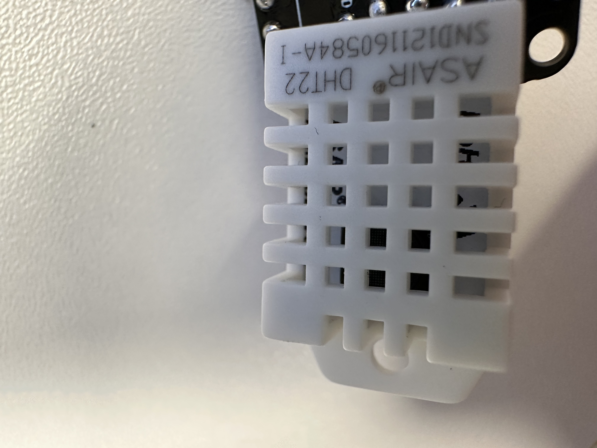

# casa0014 plant monitor 
## overview
The goal of this project is to build a sensor system that can sense air temperature and humidity and soil moisture. The data will be transmitted to the mqtt server via WiFi. The data is also stored in IfluxDB deployed on a Raspberry Pi, and we visualise the data using Telegraf, and Grafana, also deployed on a Raspberry Pi.
## Method
### Incremental build 
This project uses an incremental development model. Different components are first developed and tested independently, and then gradually integrated into a system.
Therefore the following will follow the actual development process.
## Developing process
### Feather Huzzah ESP8266 SETUP
Start the arduino IDE and plug the Huzzah ESP8266 into the USB port. 
For WIN11 system, you need to install [CP2104 driver](https://learn.adafruit.com/adafruit-feather-huzzah-esp8266/using-arduino-ide) in advance for the first time to use this development board, so that arduino IDE will not recognise it.
**WIFI connection** 
This development board has a WiFi chip on board, which means we can connect directly to the internet. Firstly we need to test the WiFi functionality of this development board. The script for this test can be found [here](https://github.com/liangleiliu-lab/casa0017_plant_monitor/blob/main/code/esp8266_wifi_connection_setup.ino). Here we need to include the ESP8266 WiFi library to make it easier for us to access the internet.

In the script, we need to add the name and password of the WiFi we want to connect to.
```C++
#include <ESP8266WiFi.h>

const char* ssid     = "SSID here";
const char* password = "password here";
```
Also we need to turn on the serial monitor so that we can print out debugging information.

### Feather Huzzah ESP8266 send data to MQTT server
This part is designed to connect an ESP8266 microcontroller to a Wi-Fi network and an MQTT (Message Queuing Telemetry Transport) server for publishing and subscribing to messages. The full test code can be found [here](https://github.com/liangleiliu-lab/casa0017_plant_monitor/blob/main/code/esp8266_test_mqtt_connection.ino). 

We used the [PubSubClient](https://pubsubclient.knolleary.net/) library to do many of the MQTT connection setup.Here we test using the MQTT server provided by the lab at `mqtt.cetools.org`.For server security, we use a separate file [arduino_secrets.h](https://github.com/liangleiliu-lab/casa0017_plant_monitor/blob/main/arduino_sercert.h) to store WiFi and MQTT-related credentials.
```c
#define SECRET_SSID "xxx"
#define SECRET_PASS "xxx"
#define SECRET_MQTTUSER "xxx"
#define SECRET_MQTTPASS "xxx"
```
In this side of the script we send a message to the MQTT server and subscribe to the message at the same time, if the first bit of the payload of the message we subscribe to is 1, the led light of the development board will light up, otherwise it will not light up.

### Detection of air temperature and humidity and soil moisture
For air temperature and humidity, we use a DHT22 sensor for measurement.

<div align="center">
  DTH22
</div>

The code for the testing of this temperature and humidity sensor can be found [here](https://github.com/liangleiliu-lab/casa0017_plant_monitor/blob/main/code/DHT22_TEST.ino), again we used a library written specifically for the DHT22.

For soil moisture detection, we used nail-type moisture sensors, also known as soil moisture probes or spikes, are tools used to measure the water content in soil. These sensors are particularly useful in agriculture, landscaping, and environmental monitoring to ensure optimal soil moisture levels for plant growth and soil health.

**Working Principle:**
 Most nail-type sensors operate based on electrical resistance or capacitance. They measure how easily an electrical current can pass through the soil, which changes with the soil's moisture content.
Conductivity: In general, wet soil conducts electricity better than dry soil. So, the more moisture in the soil, the less resistance or the higher capacitance the sensor will detect.
Below are its schematic and physical diagrams respectively.

The code for the testing of this nail-type moisture sensor can be found [here](https://github.com/liangleiliu-lab/casa0017_plant_monitor/blob/main/code/moisture_test.ino). The fact that the data we get from our measurements are purely resistance values, we need to plot **the corresponding calibration curves** to be able to accurately judge the moisture content of the soil.
### ESP send soil and air data to MQTT
What we need to do in this step is to integrate the previous parts. That is, we use the nail sensor and the DHT22 to get the soil moisture and air temperature and humidity, and then send this data to the MQTT server in real time. the final code can be found [here](https://github.com/liangleiliu-lab/casa0017_plant_monitor/blob/main/code/plant_monitor.ino).
Below is a picture of the product actually deployed to Rosemary.

At this point we will be able to see the data sent to the MQTT server.

## Data visualization
We will use a Raspberry Pi as a gateway. First we will initialise the Raspberry Pi while connecting to your Raspberry Pi via SSH.
We then install [influxDB](https://portal.influxdata.com/downloads/#influxdb) on the Raspberry Pi, which allows us to download and store the data placed on the MQTT server.
**the installation process is as follows**
1. Add the InfluxDB key to ensure secure download and the repository to the sources list so that we can download it in the next step.
``` C++ 
wget -q https://repos.influxdata.com/influxdata-archive_compat.key
echo '393e8779c89ac8d958f81f942f9ad7fb82a25e133faddaf92e15b16e6ac9ce4c influxdata-archive_compat.key' | sha256sum -c && cat influxdata-archive_compat.key | gpg --dearmor | sudo tee /etc/apt/trusted.gpg.d/influxdata-archive_compat.gpg > /dev/null
echo 'deb [signed-by=/etc/apt/trusted.gpg.d/influxdata-archive_compat.gpg] https://repos.influxdata.com/debian stable main' | sudo tee /etc/apt/sources.list.d/influxdata.list
```
2. With the repository added we now run another update to the package list
```
sudo apt-get update
```
3. Finally we install InfluxDB
```
sudo apt-get install influxdb2 -y
This should result in an output similar to that in the image below:
```
Finally to get InfluxDB up and running at reboot we need to enable and start it within systemctl:
``` 
sudo systemctl unmask influxdb.service
sudo systemctl start influxdb
sudo systemctl enable influxdb.service
```
You can check if it is running ok with:
```
sudo systemctl status influxdb
```
Use to break out of the systemctl command and get back to the terminal prompt.CTRL C

We now be able to browse to your instance of InfluxDB running on machine - in my case I browse to `http://stdu-pi-ucfnll0.celab:8086/`

### installing Telegraf on RPi
Telegraf is a time-series data collector - lots of information is available [here](https://docs.influxdata.com/telegraf/v1.24/). 
Get back to the terminal on the RPi and install telegraf using the following command:

```
sudo apt-get update && sudo apt-get install telegraf -y
```
Step 2
Telegraf has lots of configuration options - the default file can be viewed at:

```
cat /etc/telegraf/telegraf.conf
```
To get started we will use a minimal CE setup so that you can see the basic elements of a [configuration](https://github.com/liangleiliu-lab/casa0017_plant_monitor/blob/main/configuration/Telegraf%20configuration). But first we will explore data from the RPi template we installed in the previous step to see how the telegraf scripts work. Browse to and select.

After setting up the profile, we can see the visualised data.

## TO DO list
We need to measure the calibration curve of the nail moisture sensor under fixed conditions (temperature, soil, nail spacing).
**Understanding soil moisture sensor calibration curves**
Typically, readings from soil moisture sensors (such as resistance or capacitance based sensors) vary as soil moisture increases. The purpose of a calibration curve is to find the relationship between sensor readings and actual soil moisture content.
**Steps to develop a calibration curve**
1. Data collection: Collect sensor readings at different soil moisture contents.
2. Data Analysis: Use the data points to plot the curve on a graph and fit the points with a mathematical model (e.g. linear or polynomial regression).
3. Validation: Use the new data points to verify the accuracy of the calibration curve.
